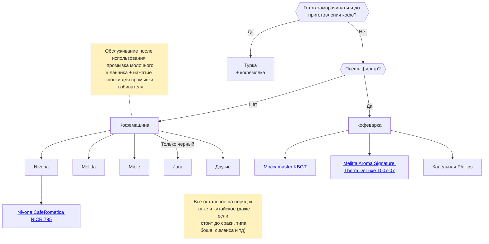

## Выбор кофемашины

любоый текст

```mermaid

flowchart TD
    classDef noteStyle fill:#FFF2BF, stroke:#F4F7FF, stroke-width:1px;
    classDef explainStyle fill:#FFF, stroke:#FFF, stroke-width:1px;

	%% Условия
	is_ready_for_zamoroch{{Готов заморачиваться до приготовления кофе?}}
	is_filter_ok{{Пьешь фильтр?}}

	%% Варианты
	turka[
		Турка 
		+ кофемолка
	]
	kofevarka[
		кофеварка 
	]
	
  noteOther["Всё остальное на порядок
  хуже и китайское (даже если
  стоит до сраки, типа боша, сименса и тд)"
  ]:::noteStyle

  noteCoffeeMachine["Обслуживание после использования:
  промывка молочного шланчика + нажатие кнопки для промывки
  взбивателя"
  ]:::noteStyle
	
	coffeMachine[Кофемашина]
	nivona[Nivona]
	melitta[Melitta]
	miele[Miele]
	jura[Jura]
	other[Другие]

  %% Конкретные модели
	MoccamasterKBGT[
    <a href="https://www.ozon.ru/product/elektricheskaya-kapelnaya-kofevarka-moccamaster-kbgt-tsvet-belyy-825704536/"
    target="_blank">Moccamaster KBGT</a>
  ]
	Melitta1007[
    <a href="https://perfetto-shop.ru/product/melitta-aromasignature-deluxe-therm-steel/"
    target="_blank">Melitta Aroma Signature Therm DeLuxe 1007-07</a>
  ]
  NivonaCafeRomaticaNICR795[
    <a href="https://www.ozon.ru/product/kofemashina-nivona-caferomatica-nicr-795-1406064185/"
    target="_blank">Nivona CafeRomatica NICR 795</a>
  ]
  PhillipsKapel[Капельная Phillips]
	
	%% Связи
	is_ready_for_zamoroch -->|Да|turka
	is_ready_for_zamoroch -->|Нет|is_filter_ok

  noteCoffeeMachine  -.- coffeMachine

	coffeMachine --> nivona --> NivonaCafeRomaticaNICR795
	coffeMachine --> melitta
	coffeMachine --> miele
	coffeMachine --> |Только черный|jura
	coffeMachine --> other

  other -.- noteOther
	
	is_filter_ok --> |Да|kofevarka
	is_filter_ok --> |Нет|coffeMachine

  kofevarka --> MoccamasterKBGT
  kofevarka --> Melitta1007
  kofevarka --> PhillipsKapel

```
